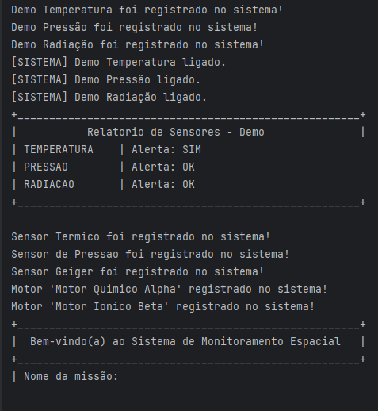

# MonitoraOrbita - Plataforma de Monitoramento Espacial

Projeto desenvolvido para a Global Solution 2026 da disciplina de Programação Orientada a Objetos (POO) - FIAP.

Simula uma plataforma de monitoramento de uma estação espacial com sensores, sistemas de propulsão e gerenciamento de dados de missão, operada via menu interativo no terminal.

---

## Funcionalidades

- Leitura simulada de sensores de temperatura, pressão e radiação
- Detecção automática de valores fora do limite com classificação por nível de alerta
- Controle dos motores de propulsão química e elétrica com validação de potência
- Gerenciamento de dados da missão com encapsulamento e proteção por senha
- Simulação de 5 leituras aleatórias consecutivas para demonstrar o sistema de alertas
- Menu interativo completo com submenus para cada área do sistema

---

## Conceitos de POO aplicados

| Conceito | Onde foi aplicado |
|---|---|
| Classe abstrata | `ComponenteEspacial` e `SistemaPropulsao` |
| Interface | `Sensor`, implementada por `SensorTemperatura`, `SensorPressao` e `SensorRadiacao` |
| Encapsulamento | `DadosMissao` — atributos privados, getters/setters com validação e dados sensíveis protegidos por senha |
| Herança | `PropulsaoQuimica` e `PropulsaoEletrica` herdam de `SistemaPropulsao`; sensores herdam de `ComponenteEspacial` |
| Polimorfismo | `List<Sensor>` usada em `Main` e `Menu` para iterar sobre tipos diferentes de sensores |

---

## Estrutura do projeto

```
projeto-espacial/
└── src/
    └── br/
        └── com/
            └── monitoraorbita/
                ├── main/
                │   └── Main.java
                └── model/
                    ├── ComponenteEspacial.java
                    ├── Sensor.java
                    ├── SensorTemperatura.java
                    ├── SensorPressao.java
                    ├── SensorRadiacao.java
                    ├── DadosMissao.java
                    ├── SistemaPropulsao.java
                    ├── PropulsaoQuimica.java
                    ├── PropulsaoEletrica.java
                    └── Menu.java
```
---

## Demonstração do sistema

### Inicialização e cadastro da missão

Ao iniciar, o sistema exibe um relatório de demonstração dos sensores e solicita os dados da missão.

<p align="center">
  
</p>

## Integrantes

| Nome | RM |
|---|---|
| Laís Krajner Lacerda| 563182 |
| Luana Magalhães Freire| 565305 |
| Pamella Souza da Silva Ferreira	| 566172 |
